```python
import pandas as pd
import itertools
from sklearn.metrics import classification_report,confusion_matrix, accuracy_score
from sklearn.model_selection import train_test_split
import pandas as pd
import numpy as np
import matplotlib.pyplot as plt
import xgboost as xgb
from lightgbm import LGBMClassifier
import os
import seaborn as sns
from wordcloud import WordCloud
```


```python
df=pd.read_csv('malicious_phish.csv')

print(df.shape)
df.head()
```

    (651191, 2)


<div>
<style scoped>
    .dataframe tbody tr th:only-of-type {
        vertical-align: middle;
    }

    .dataframe tbody tr th {
        vertical-align: top;
    }

    .dataframe thead th {
        text-align: right;
    }
</style>
<table border="1" class="dataframe">
  <thead>
    <tr style="text-align: right;">
      <th></th>
      <th>url</th>
      <th>type</th>
    </tr>
  </thead>
  <tbody>
    <tr>
      <th>0</th>
      <td>br-icloud.com.br</td>
      <td>phishing</td>
    </tr>
    <tr>
      <th>1</th>
      <td>mp3raid.com/music/krizz_kaliko.html</td>
      <td>benign</td>
    </tr>
    <tr>
      <th>2</th>
      <td>bopsecrets.org/rexroth/cr/1.htm</td>
      <td>benign</td>
    </tr>
    <tr>
      <th>3</th>
      <td>http://www.garage-pirenne.be/index.php?option=...</td>
      <td>defacement</td>
    </tr>
    <tr>
      <th>4</th>
      <td>http://adventure-nicaragua.net/index.php?optio...</td>
      <td>defacement</td>
    </tr>
  </tbody>
</table>
</div>


```python
df.type.value_counts()
```


    type
    benign        428103
    defacement     96457
    phishing       94111
    malware        32520
    Name: count, dtype: int64


## Plotting Wordcloud


```python
df_phish = df[df.type=='phishing']
df_malware = df[df.type=='malware']
df_deface = df[df.type=='defacement']
df_benign = df[df.type=='benign']

```


```python
phish_url = " ".join(i for i in df_phish.url)
wordcloud = WordCloud(width=1600, height=800,colormap='Paired').generate(phish_url)
plt.figure( figsize=(12,14),facecolor='k')
plt.imshow(wordcloud, interpolation='bilinear')
plt.axis("off")
plt.tight_layout(pad=0)
plt.show()
```


    

    


```python
malware_url = " ".join(i for i in df_malware.url)
wordcloud = WordCloud(width=1600, height=800,colormap='Paired').generate(malware_url)
plt.figure( figsize=(12,14),facecolor='k')
plt.imshow(wordcloud, interpolation='bilinear')
plt.axis("off")
plt.tight_layout(pad=0)
plt.show()
```


    

    


```python
deface_url = " ".join(i for i in df_deface.url)
wordcloud = WordCloud(width=1600, height=800,colormap='Paired').generate(deface_url)
plt.figure( figsize=(12,14),facecolor='k')
plt.imshow(wordcloud, interpolation='bilinear')
plt.axis("off")
plt.tight_layout(pad=0)
plt.show()
```


    

    


```python
benign_url = " ".join(i for i in df_benign.url)
wordcloud = WordCloud(width=1600, height=800,colormap='Paired').generate(benign_url)
plt.figure( figsize=(12,14),facecolor='k')
plt.imshow(wordcloud, interpolation='bilinear')
plt.axis("off")
plt.tight_layout(pad=0)
plt.show()
```


    

    


```python
# ✅ URL Normalizer (add BEFORE feature engineering)
from urllib.parse import urlparse, urlunparse
import pandas as pd, re

def canonicalize_url(raw: str) -> str:
    if raw is None or (isinstance(raw, float) and pd.isna(raw)): return "http://"
    s = str(raw).strip()
    if not s: return "http://"

    s = re.sub(r'[^\x20-\x7E]', '', s)  # remove non-ascii garbage chars

    if not s.lower().startswith(("http://", "https://")):
        s = "http://" + s

    try: u = urlparse(s)
    except ValueError:
        s = s.replace("[","").replace("]","")  # IPv6 cleanup
        u = urlparse(s)

    host = (u.hostname or "").lower()
    try: port = u.port
    except ValueError: port = None
    netloc = host if port is None else f"{host}:{port}"

    path = u.path or ""
    if path != "/" and path.endswith("/"): path = path[:-1]

    return urlunparse((u.scheme.lower(), netloc, path, u.params, u.query, u.fragment))

```

## Feature Engineering


```python
df['url'] = df['url'].astype(str).apply(canonicalize_url)

import re
#Use of IP or not in domain
def having_ip_address(url):
    match = re.search(
        '(([01]?\\d\\d?|2[0-4]\\d|25[0-5])\\.([01]?\\d\\d?|2[0-4]\\d|25[0-5])\\.([01]?\\d\\d?|2[0-4]\\d|25[0-5])\\.'
        '([01]?\\d\\d?|2[0-4]\\d|25[0-5])\\/)|'  # IPv4
        '((0x[0-9a-fA-F]{1,2})\\.(0x[0-9a-fA-F]{1,2})\\.(0x[0-9a-fA-F]{1,2})\\.(0x[0-9a-fA-F]{1,2})\\/)' # IPv4 in hexadecimal
        '(?:[a-fA-F0-9]{1,4}:){7}[a-fA-F0-9]{1,4}', url)  # Ipv6
    if match:
        # print match.group()
        return 1
    else:
        # print 'No matching pattern found'
        return 0
df['use_of_ip'] = df['url'].apply(lambda i: having_ip_address(i))
```


```python
from urllib.parse import urlparse

def abnormal_url(url):
    try:
        hostname = urlparse(url).hostname or ""
        hostname = re.escape(hostname)  # ✅ escape regex unsafe chars
        match = re.search(hostname, url)
        return 1 if match else 0
    except:
        return 0

df['abnormal_url'] = df['url'].apply(lambda i: abnormal_url(i))

```


```python
pip install googlesearch-python
```

    Requirement already satisfied: googlesearch-python in c:\users\hp\anaconda3\lib\site-packages (1.3.0)Note: you may need to restart the kernel to use updated packages.
    
    Requirement already satisfied: beautifulsoup4>=4.9 in c:\users\hp\anaconda3\lib\site-packages (from googlesearch-python) (4.12.3)
    Requirement already satisfied: requests>=2.20 in c:\users\hp\anaconda3\lib\site-packages (from googlesearch-python) (2.32.3)
    Requirement already satisfied: soupsieve>1.2 in c:\users\hp\anaconda3\lib\site-packages (from beautifulsoup4>=4.9->googlesearch-python) (2.5)
    Requirement already satisfied: charset-normalizer<4,>=2 in c:\users\hp\anaconda3\lib\site-packages (from requests>=2.20->googlesearch-python) (3.3.2)
    Requirement already satisfied: idna<4,>=2.5 in c:\users\hp\anaconda3\lib\site-packages (from requests>=2.20->googlesearch-python) (3.7)
    Requirement already satisfied: urllib3<3,>=1.21.1 in c:\users\hp\anaconda3\lib\site-packages (from requests>=2.20->googlesearch-python) (2.3.0)
    Requirement already satisfied: certifi>=2017.4.17 in c:\users\hp\anaconda3\lib\site-packages (from requests>=2.20->googlesearch-python) (2025.10.5)


```python
from googlesearch import search
```


```python
def google_index(url):
    site = search(url, 5)
    return 1 if site else 0
df['google_index'] = df['url'].apply(lambda i: google_index(i))
```


```python
def count_dot(url):
    count_dot = url.count('.')
    return count_dot

df['count.'] = df['url'].apply(lambda i: count_dot(i))
df.head()
```


<div>
<style scoped>
    .dataframe tbody tr th:only-of-type {
        vertical-align: middle;
    }

    .dataframe tbody tr th {
        vertical-align: top;
    }

    .dataframe thead th {
        text-align: right;
    }
</style>
<table border="1" class="dataframe">
  <thead>
    <tr style="text-align: right;">
      <th></th>
      <th>url</th>
      <th>type</th>
      <th>use_of_ip</th>
      <th>abnormal_url</th>
      <th>google_index</th>
      <th>count.</th>
    </tr>
  </thead>
  <tbody>
    <tr>
      <th>0</th>
      <td>http://br-icloud.com.br</td>
      <td>phishing</td>
      <td>0</td>
      <td>1</td>
      <td>1</td>
      <td>2</td>
    </tr>
    <tr>
      <th>1</th>
      <td>http://mp3raid.com/music/krizz_kaliko.html</td>
      <td>benign</td>
      <td>0</td>
      <td>1</td>
      <td>1</td>
      <td>2</td>
    </tr>
    <tr>
      <th>2</th>
      <td>http://bopsecrets.org/rexroth/cr/1.htm</td>
      <td>benign</td>
      <td>0</td>
      <td>1</td>
      <td>1</td>
      <td>2</td>
    </tr>
    <tr>
      <th>3</th>
      <td>http://www.garage-pirenne.be/index.php?option=...</td>
      <td>defacement</td>
      <td>0</td>
      <td>1</td>
      <td>1</td>
      <td>3</td>
    </tr>
    <tr>
      <th>4</th>
      <td>http://adventure-nicaragua.net/index.php?optio...</td>
      <td>defacement</td>
      <td>0</td>
      <td>1</td>
      <td>1</td>
      <td>2</td>
    </tr>
  </tbody>
</table>
</div>


```python
def count_www(url):
    url.count('www')
    return url.count('www')

df['count-www'] = df['url'].apply(lambda i: count_www(i))

def count_atrate(url):
     
    return url.count('@')

df['count@'] = df['url'].apply(lambda i: count_atrate(i))


def no_of_dir(url):
    urldir = urlparse(url).path
    return urldir.count('/')

df['count_dir'] = df['url'].apply(lambda i: no_of_dir(i))

def no_of_embed(url):
    urldir = urlparse(url).path
    return urldir.count('//')

df['count_embed_domian'] = df['url'].apply(lambda i: no_of_embed(i))


def shortening_service(url):
    match = re.search('bit\.ly|goo\.gl|shorte\.st|go2l\.ink|x\.co|ow\.ly|t\.co|tinyurl|tr\.im|is\.gd|cli\.gs|'
                      'yfrog\.com|migre\.me|ff\.im|tiny\.cc|url4\.eu|twit\.ac|su\.pr|twurl\.nl|snipurl\.com|'
                      'short\.to|BudURL\.com|ping\.fm|post\.ly|Just\.as|bkite\.com|snipr\.com|fic\.kr|loopt\.us|'
                      'doiop\.com|short\.ie|kl\.am|wp\.me|rubyurl\.com|om\.ly|to\.ly|bit\.do|t\.co|lnkd\.in|'
                      'db\.tt|qr\.ae|adf\.ly|goo\.gl|bitly\.com|cur\.lv|tinyurl\.com|ow\.ly|bit\.ly|ity\.im|'
                      'q\.gs|is\.gd|po\.st|bc\.vc|twitthis\.com|u\.to|j\.mp|buzurl\.com|cutt\.us|u\.bb|yourls\.org|'
                      'x\.co|prettylinkpro\.com|scrnch\.me|filoops\.info|vzturl\.com|qr\.net|1url\.com|tweez\.me|v\.gd|'
                      'tr\.im|link\.zip\.net',
                      url)
    if match:
        return 1
    else:
        return 0
    
    
df['short_url'] = df['url'].apply(lambda i: shortening_service(i))
```


```python
def count_https(url):
    return url.count('https')

df['count-https'] = df['url'].apply(lambda i : count_https(i))

def count_http(url):
    return url.count('http')

df['count-http'] = df['url'].apply(lambda i : count_http(i))
```


```python
def count_per(url):
    return url.count('%')

df['count%'] = df['url'].apply(lambda i : count_per(i))

def count_ques(url):
    return url.count('?')

df['count?'] = df['url'].apply(lambda i: count_ques(i))

def count_hyphen(url):
    return url.count('-')

df['count-'] = df['url'].apply(lambda i: count_hyphen(i))

def count_equal(url):
    return url.count('=')

df['count='] = df['url'].apply(lambda i: count_equal(i))

def url_length(url):
    return len(str(url))


#Length of URL
df['url_length'] = df['url'].apply(lambda i: url_length(i))
#Hostname Length

def hostname_length(url):
    return len(urlparse(url).netloc)

df['hostname_length'] = df['url'].apply(lambda i: hostname_length(i))

df.head()

def suspicious_words(url):
    match = re.search('PayPal|login|signin|bank|account|update|free|lucky|service|bonus|ebayisapi|webscr',
                      url)
    if match:
        return 1
    else:
        return 0
df['sus_url'] = df['url'].apply(lambda i: suspicious_words(i))


def digit_count(url):
    digits = 0
    for i in url:
        if i.isnumeric():
            digits = digits + 1
    return digits


df['count-digits']= df['url'].apply(lambda i: digit_count(i))


def letter_count(url):
    letters = 0
    for i in url:
        if i.isalpha():
            letters = letters + 1
    return letters


df['count-letters']= df['url'].apply(lambda i: letter_count(i))

df.head()
```


<div>
<style scoped>
    .dataframe tbody tr th:only-of-type {
        vertical-align: middle;
    }

    .dataframe tbody tr th {
        vertical-align: top;
    }

    .dataframe thead th {
        text-align: right;
    }
</style>
<table border="1" class="dataframe">
  <thead>
    <tr style="text-align: right;">
      <th></th>
      <th>url</th>
      <th>type</th>
      <th>use_of_ip</th>
      <th>abnormal_url</th>
      <th>google_index</th>
      <th>count.</th>
      <th>count-www</th>
      <th>count@</th>
      <th>count_dir</th>
      <th>count_embed_domian</th>
      <th>...</th>
      <th>count-http</th>
      <th>count%</th>
      <th>count?</th>
      <th>count-</th>
      <th>count=</th>
      <th>url_length</th>
      <th>hostname_length</th>
      <th>sus_url</th>
      <th>count-digits</th>
      <th>count-letters</th>
    </tr>
  </thead>
  <tbody>
    <tr>
      <th>0</th>
      <td>http://br-icloud.com.br</td>
      <td>phishing</td>
      <td>0</td>
      <td>1</td>
      <td>1</td>
      <td>2</td>
      <td>0</td>
      <td>0</td>
      <td>0</td>
      <td>0</td>
      <td>...</td>
      <td>1</td>
      <td>0</td>
      <td>0</td>
      <td>1</td>
      <td>0</td>
      <td>23</td>
      <td>16</td>
      <td>0</td>
      <td>0</td>
      <td>17</td>
    </tr>
    <tr>
      <th>1</th>
      <td>http://mp3raid.com/music/krizz_kaliko.html</td>
      <td>benign</td>
      <td>0</td>
      <td>1</td>
      <td>1</td>
      <td>2</td>
      <td>0</td>
      <td>0</td>
      <td>2</td>
      <td>0</td>
      <td>...</td>
      <td>1</td>
      <td>0</td>
      <td>0</td>
      <td>0</td>
      <td>0</td>
      <td>42</td>
      <td>11</td>
      <td>0</td>
      <td>1</td>
      <td>33</td>
    </tr>
    <tr>
      <th>2</th>
      <td>http://bopsecrets.org/rexroth/cr/1.htm</td>
      <td>benign</td>
      <td>0</td>
      <td>1</td>
      <td>1</td>
      <td>2</td>
      <td>0</td>
      <td>0</td>
      <td>3</td>
      <td>0</td>
      <td>...</td>
      <td>1</td>
      <td>0</td>
      <td>0</td>
      <td>0</td>
      <td>0</td>
      <td>38</td>
      <td>14</td>
      <td>0</td>
      <td>1</td>
      <td>29</td>
    </tr>
    <tr>
      <th>3</th>
      <td>http://www.garage-pirenne.be/index.php?option=...</td>
      <td>defacement</td>
      <td>0</td>
      <td>1</td>
      <td>1</td>
      <td>3</td>
      <td>1</td>
      <td>0</td>
      <td>1</td>
      <td>0</td>
      <td>...</td>
      <td>1</td>
      <td>0</td>
      <td>1</td>
      <td>1</td>
      <td>4</td>
      <td>88</td>
      <td>21</td>
      <td>0</td>
      <td>7</td>
      <td>63</td>
    </tr>
    <tr>
      <th>4</th>
      <td>http://adventure-nicaragua.net/index.php?optio...</td>
      <td>defacement</td>
      <td>0</td>
      <td>1</td>
      <td>1</td>
      <td>2</td>
      <td>0</td>
      <td>0</td>
      <td>1</td>
      <td>0</td>
      <td>...</td>
      <td>1</td>
      <td>0</td>
      <td>1</td>
      <td>1</td>
      <td>3</td>
      <td>235</td>
      <td>23</td>
      <td>0</td>
      <td>22</td>
      <td>199</td>
    </tr>
  </tbody>
</table>
<p>5 rows × 22 columns</p>
</div>


```python
pip install tld
```

    Requirement already satisfied: tld in c:\users\hp\anaconda3\lib\site-packages (0.13.1)
    Note: you may need to restart the kernel to use updated packages.


```python
#Importing dependencies
from urllib.parse import urlparse
from tld import get_tld
import os.path

#First Directory Length
def fd_length(url):
    urlpath= urlparse(url).path
    try:
        return len(urlpath.split('/')[1])
    except:
        return 0

df['fd_length'] = df['url'].apply(lambda i: fd_length(i))

#Length of Top Level Domain
df['tld'] = df['url'].apply(lambda i: get_tld(i,fail_silently=True))


def tld_length(tld):
    try:
        return len(tld)
    except:
        return -1

df['tld_length'] = df['tld'].apply(lambda i: tld_length(i))
```


```python
df = df.drop("tld", axis=1)
```


```python
df.columns
```


    Index(['url', 'type', 'use_of_ip', 'abnormal_url', 'google_index', 'count.',
           'count-www', 'count@', 'count_dir', 'count_embed_domian', 'short_url',
           'count-https', 'count-http', 'count%', 'count?', 'count-', 'count=',
           'url_length', 'hostname_length', 'sus_url', 'count-digits',
           'count-letters', 'fd_length', 'tld_length'],
          dtype='object')


```python
df['type'].value_counts()
```


    type
    benign        428103
    defacement     96457
    phishing       94111
    malware        32520
    Name: count, dtype: int64


## EDA

## 1. Distribution of use_of_ip


```python
import seaborn as sns
sns.set(style="darkgrid")
ax = sns.countplot(y="type", data=df,hue="use_of_ip")

```


    
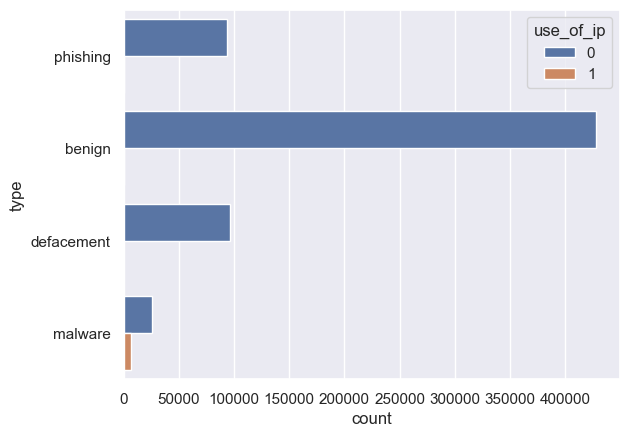
    


## 2. Distribution of abnormal url


```python
sns.set(style="darkgrid")
ax = sns.countplot(y="type", data=df,hue="abnormal_url")

```


    

    


## 3. Distribution of Google Index


```python
sns.set(style="darkgrid")
ax = sns.countplot(y="type", data=df,hue="google_index")
```


    
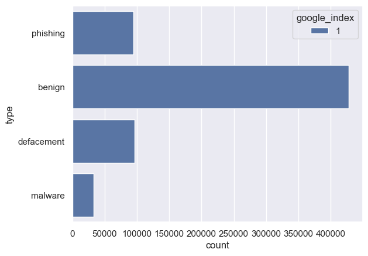
    


## 4. Distribution of Shorl URL


```python
sns.set(style="darkgrid")
ax = sns.countplot(y="type", data=df,hue="short_url")
```


    
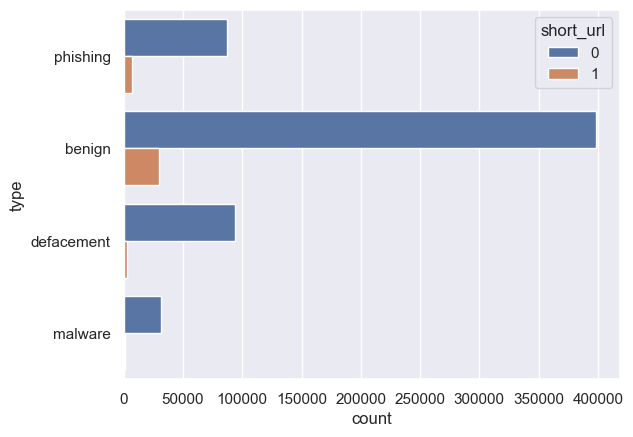
    


## 5. Distribution of Suspicious URL


```python
sns.set(style="darkgrid")
ax = sns.countplot(y="type", data=df,hue="sus_url")
```


    
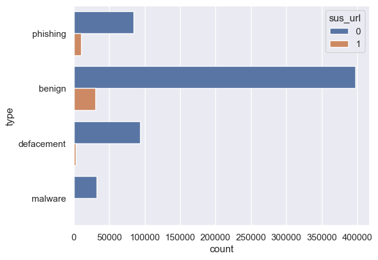
    


## 6. Distribution of count of [.] dot


```python
sns.set(style="darkgrid")
ax = sns.catplot(x="type", y="count.", kind="box", data=df)
```


    
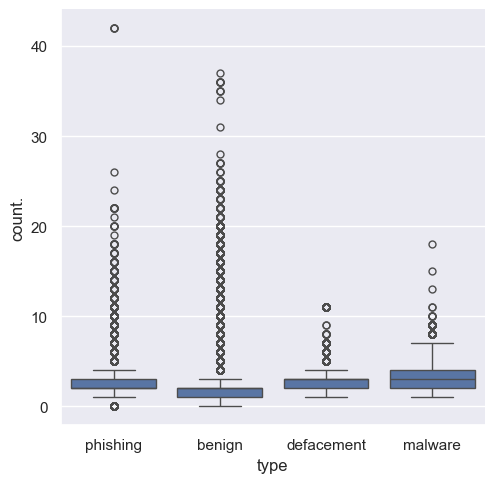
    


## 7. Distribution of count-www


```python
sns.set(style="darkgrid")
ax = sns.catplot(x="type", y="count-www", kind="box", data=df)
```


    
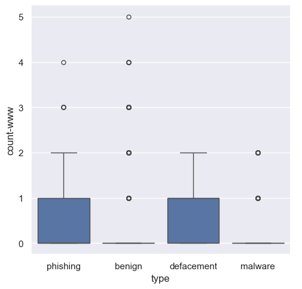
    


## 8. Distribution of count@


```python
sns.set(style="darkgrid")
ax = sns.catplot(x="type", y="count@", kind="box", data=df)
```


    
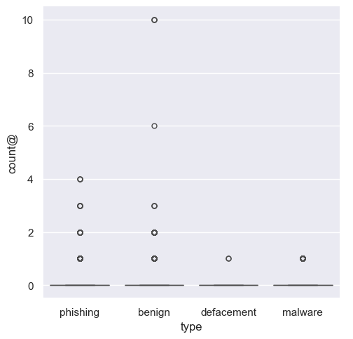
    


## 9. Distribution of count_dir


```python
sns.set(style="darkgrid")
ax = sns.catplot(x="type", y="count_dir", kind="box", data=df)
```


    
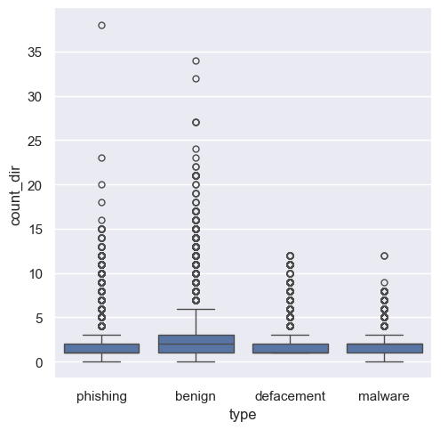
    


## 10. Distribution of hostname length


```python
sns.set(style="darkgrid")
ax = sns.catplot(x="type", y="hostname_length", kind="box", data=df)
```


    
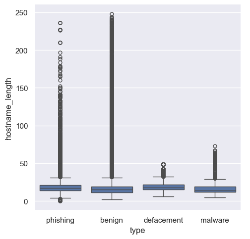
    


## 11. Distribution of first directory length


```python
sns.set(style="darkgrid")
ax = sns.catplot(x="type", y="fd_length", kind="box", data=df)
```


    
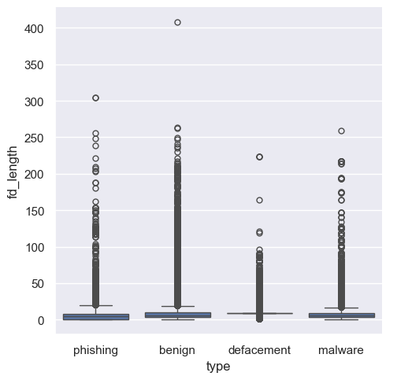
    


## 12. Distribution of top-level domain length


```python
sns.set(style="darkgrid")
ax = sns.catplot(x="type", y="tld_length", kind="box", data=df)
```


    
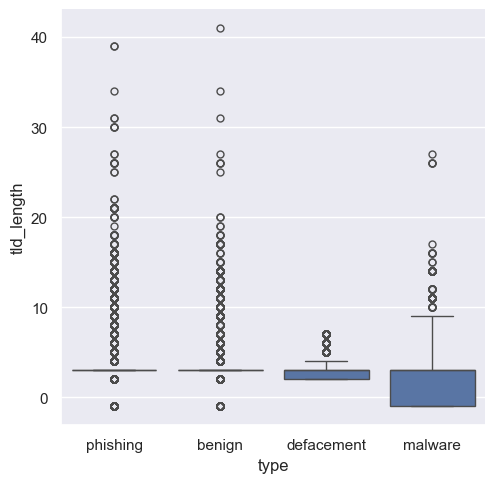
    


## Target Encoding


```python
from sklearn.preprocessing import LabelEncoder

lb_make = LabelEncoder()
df["type_code"] = lb_make.fit_transform(df["type"])
df["type_code"].value_counts()


```


    type_code
    0    428103
    1     96457
    3     94111
    2     32520
    Name: count, dtype: int64


## Creation of Feature & Target 


```python
#Predictor Variables
# filtering out google_index as it has only 1 value
X = df[['use_of_ip','abnormal_url', 'count.', 'count-www', 'count@',
       'count_dir', 'count_embed_domian', 'short_url', 'count-https',
       'count-http', 'count%', 'count?', 'count-', 'count=', 'url_length',
       'hostname_length', 'sus_url', 'fd_length', 'tld_length', 'count-digits',
       'count-letters']]

#Target Variable
y = df['type_code']
```


```python
X.head()
```


<div>
<style scoped>
    .dataframe tbody tr th:only-of-type {
        vertical-align: middle;
    }

    .dataframe tbody tr th {
        vertical-align: top;
    }

    .dataframe thead th {
        text-align: right;
    }
</style>
<table border="1" class="dataframe">
  <thead>
    <tr style="text-align: right;">
      <th></th>
      <th>use_of_ip</th>
      <th>abnormal_url</th>
      <th>count.</th>
      <th>count-www</th>
      <th>count@</th>
      <th>count_dir</th>
      <th>count_embed_domian</th>
      <th>short_url</th>
      <th>count-https</th>
      <th>count-http</th>
      <th>...</th>
      <th>count?</th>
      <th>count-</th>
      <th>count=</th>
      <th>url_length</th>
      <th>hostname_length</th>
      <th>sus_url</th>
      <th>fd_length</th>
      <th>tld_length</th>
      <th>count-digits</th>
      <th>count-letters</th>
    </tr>
  </thead>
  <tbody>
    <tr>
      <th>0</th>
      <td>0</td>
      <td>1</td>
      <td>2</td>
      <td>0</td>
      <td>0</td>
      <td>0</td>
      <td>0</td>
      <td>0</td>
      <td>0</td>
      <td>1</td>
      <td>...</td>
      <td>0</td>
      <td>1</td>
      <td>0</td>
      <td>23</td>
      <td>16</td>
      <td>0</td>
      <td>0</td>
      <td>6</td>
      <td>0</td>
      <td>17</td>
    </tr>
    <tr>
      <th>1</th>
      <td>0</td>
      <td>1</td>
      <td>2</td>
      <td>0</td>
      <td>0</td>
      <td>2</td>
      <td>0</td>
      <td>0</td>
      <td>0</td>
      <td>1</td>
      <td>...</td>
      <td>0</td>
      <td>0</td>
      <td>0</td>
      <td>42</td>
      <td>11</td>
      <td>0</td>
      <td>5</td>
      <td>3</td>
      <td>1</td>
      <td>33</td>
    </tr>
    <tr>
      <th>2</th>
      <td>0</td>
      <td>1</td>
      <td>2</td>
      <td>0</td>
      <td>0</td>
      <td>3</td>
      <td>0</td>
      <td>0</td>
      <td>0</td>
      <td>1</td>
      <td>...</td>
      <td>0</td>
      <td>0</td>
      <td>0</td>
      <td>38</td>
      <td>14</td>
      <td>0</td>
      <td>7</td>
      <td>3</td>
      <td>1</td>
      <td>29</td>
    </tr>
    <tr>
      <th>3</th>
      <td>0</td>
      <td>1</td>
      <td>3</td>
      <td>1</td>
      <td>0</td>
      <td>1</td>
      <td>0</td>
      <td>0</td>
      <td>0</td>
      <td>1</td>
      <td>...</td>
      <td>1</td>
      <td>1</td>
      <td>4</td>
      <td>88</td>
      <td>21</td>
      <td>0</td>
      <td>9</td>
      <td>2</td>
      <td>7</td>
      <td>63</td>
    </tr>
    <tr>
      <th>4</th>
      <td>0</td>
      <td>1</td>
      <td>2</td>
      <td>0</td>
      <td>0</td>
      <td>1</td>
      <td>0</td>
      <td>0</td>
      <td>0</td>
      <td>1</td>
      <td>...</td>
      <td>1</td>
      <td>1</td>
      <td>3</td>
      <td>235</td>
      <td>23</td>
      <td>0</td>
      <td>9</td>
      <td>3</td>
      <td>22</td>
      <td>199</td>
    </tr>
  </tbody>
</table>
<p>5 rows × 21 columns</p>
</div>


```python
X.columns
```


    Index(['use_of_ip', 'abnormal_url', 'count.', 'count-www', 'count@',
           'count_dir', 'count_embed_domian', 'short_url', 'count-https',
           'count-http', 'count%', 'count?', 'count-', 'count=', 'url_length',
           'hostname_length', 'sus_url', 'fd_length', 'tld_length', 'count-digits',
           'count-letters'],
          dtype='object')


## Train Test Split


```python
X_train, X_test, y_train, y_test = train_test_split(X, y, stratify=y, test_size=0.2,shuffle=True, random_state=5)
```

# Model Building 

## 1. Random Forest Classifier


```python
from sklearn.ensemble import RandomForestClassifier
from sklearn import metrics
from sklearn.metrics import classification_report

rf = RandomForestClassifier(n_estimators=100, max_features='sqrt', random_state=5)
rf.fit(X_train, y_train)

y_pred_rf = rf.predict(X_test)

print(classification_report(y_test, y_pred_rf, target_names=['benign', 'defacement', 'phishing', 'malware']))

score = metrics.accuracy_score(y_test, y_pred_rf)
print("Accuracy: %0.3f" % score)
```

                  precision    recall  f1-score   support
    
          benign       0.95      0.97      0.96     85621
      defacement       0.93      0.91      0.92     19292
        phishing       0.98      0.93      0.96      6504
         malware       0.85      0.77      0.81     18822
    
        accuracy                           0.93    130239
       macro avg       0.93      0.90      0.91    130239
    weighted avg       0.93      0.93      0.93    130239
    
    Accuracy: 0.933


```python
cm = confusion_matrix(y_test, y_pred_rf)
cm_df = pd.DataFrame(cm,
                     index = ['benign', 'defacement','phishing','malware'], 
                     columns = ['benign', 'defacement','phishing','malware'])
plt.figure(figsize=(8,6))
sns.heatmap(cm_df, annot=True,fmt=".1f")
plt.title('Confusion Matrix')
plt.ylabel('Actal Values')
plt.xlabel('Predicted Values')
plt.show()
```


    
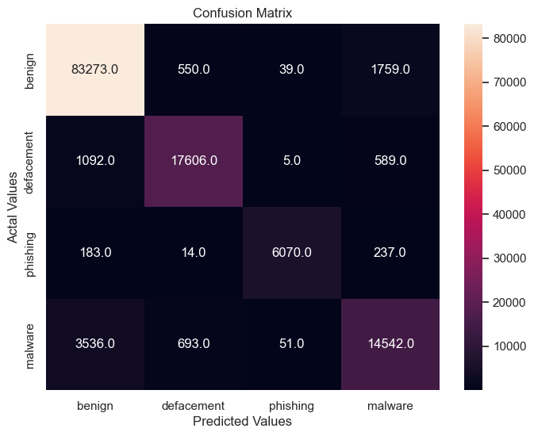
    


```python
feat_importances = pd.Series(rf.feature_importances_, index=X_train.columns)
feat_importances.sort_values().plot(kind="barh",figsize=(10, 6))
```


    <Axes: >


    
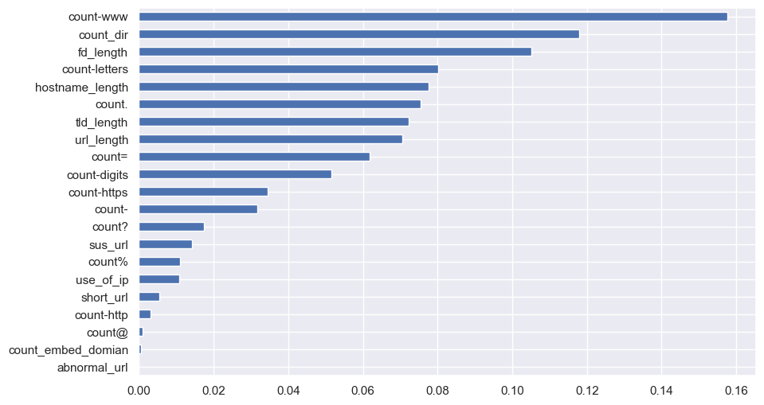
    


## 2. Light GBM Classifier


```python
from lightgbm import LGBMClassifier
from sklearn.metrics import classification_report
from sklearn import metrics

# FIX: remove 'silent=True' (deprecated). If you want no logs, use verbosity=-1.
lgb = LGBMClassifier(
    objective='multiclass',
    boosting_type='gbdt',
    n_jobs=5,
    random_state=5,
    verbosity=-1   # optional: silences LightGBM output
)

# fit
LGB_C = lgb.fit(X_train, y_train)

# predict (X_test should be a DataFrame with same columns as X_train)
y_pred_lgb = LGB_C.predict(X_test)

print(classification_report(
    y_test, y_pred_lgb,
    target_names=['benign', 'defacement', 'phishing', 'malware']
))

score = metrics.accuracy_score(y_test, y_pred_lgb)
print("accuracy:   %0.3f" % score)

```

                  precision    recall  f1-score   support
    
          benign       0.92      0.98      0.95     85621
      defacement       0.91      0.83      0.87     19292
        phishing       0.98      0.86      0.92      6504
         malware       0.85      0.70      0.77     18822
    
        accuracy                           0.91    130239
       macro avg       0.91      0.84      0.87    130239
    weighted avg       0.91      0.91      0.91    130239
    
    accuracy:   0.910


```python
cm = confusion_matrix(y_test, y_pred_lgb)
cm_df = pd.DataFrame(cm,
                     index = ['benign', 'defacement','phishing','malware'], 
                     columns = ['benign', 'defacement','phishing','malware'])
plt.figure(figsize=(8,6))
sns.heatmap(cm_df, annot=True,fmt=".1f")
plt.title('Confusion Matrix')
plt.ylabel('Actal Values')
plt.xlabel('Predicted Values')
plt.show()

```


    

    


```python
feat_importances = pd.Series(lgb.feature_importances_, index=X_train.columns)
feat_importances.sort_values().plot(kind="barh",figsize=(10, 6))
```


    <Axes: >


    
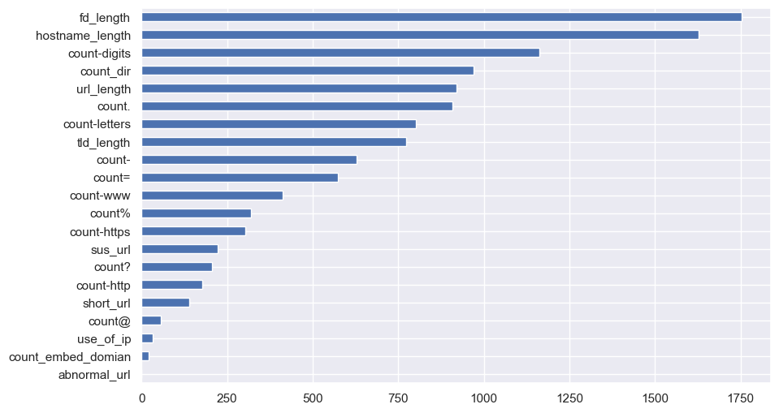
    


## 3. XGboost Classifier


```python
xgb_c = xgb.XGBClassifier(n_estimators= 100)
xgb_c.fit(X_train,y_train)
y_pred_x = xgb_c.predict(X_test)
print(classification_report(y_test,y_pred_x,target_names=['benign', 'defacement','phishing','malware']))


score = metrics.accuracy_score(y_test, y_pred_x)
print("accuracy:   %0.3f" % score)
```

                  precision    recall  f1-score   support
    
          benign       0.92      0.98      0.95     85621
      defacement       0.91      0.85      0.88     19292
        phishing       0.98      0.88      0.93      6504
         malware       0.86      0.72      0.78     18822
    
        accuracy                           0.92    130239
       macro avg       0.92      0.86      0.88    130239
    weighted avg       0.91      0.92      0.91    130239
    
    accuracy:   0.916


```python
cm = confusion_matrix(y_test, y_pred_x)
cm_df = pd.DataFrame(cm,
                     index = ['benign', 'defacement','phishing','malware'], 
                     columns = ['benign', 'defacement','phishing','malware'])
plt.figure(figsize=(8,6))
sns.heatmap(cm_df, annot=True,fmt=".1f")
plt.title('Confusion Matrix')
plt.ylabel('Actal Values')
plt.xlabel('Predicted Values')
plt.show()
```


    
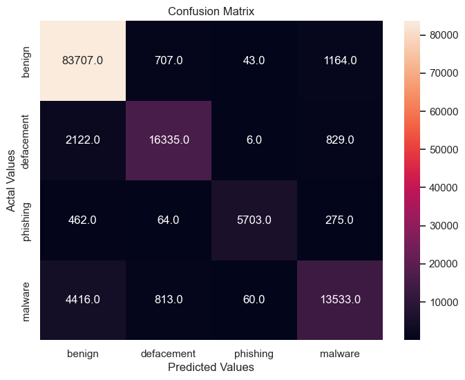
    


```python
feat_importances = pd.Series(xgb_c.feature_importances_, index=X_train.columns)
feat_importances.sort_values().plot(kind="barh",figsize=(10, 6))
```


    <Axes: >


    
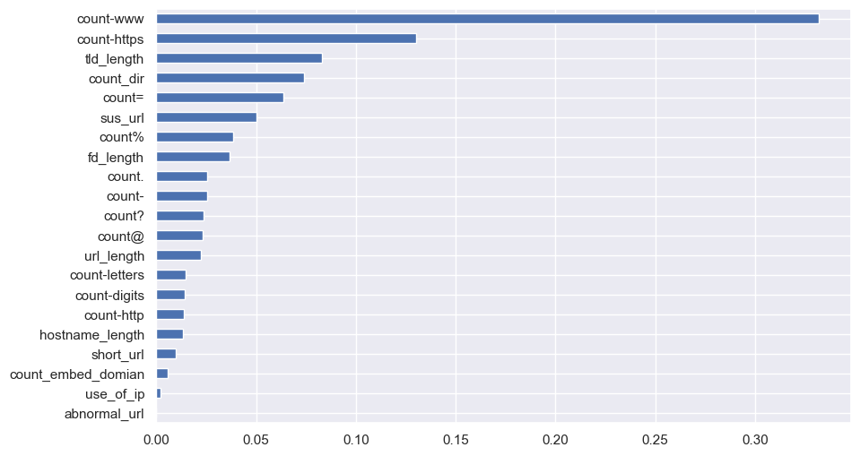
    


## Prediction


```python
def main(url):
    url = canonicalize_url(url)
    status = []
    
    status.append(having_ip_address(url))
    status.append(abnormal_url(url))
    status.append(count_dot(url))
    status.append(count_www(url))
    status.append(count_atrate(url))
    status.append(no_of_dir(url))
    status.append(no_of_embed(url))
    
    status.append(shortening_service(url))
    status.append(count_https(url))
    status.append(count_http(url))
    
    status.append(count_per(url))
    status.append(count_ques(url))
    status.append(count_hyphen(url))
    status.append(count_equal(url))
    
    status.append(url_length(url))
    status.append(hostname_length(url))
    status.append(suspicious_words(url))
    status.append(digit_count(url))
    status.append(letter_count(url))
    status.append(fd_length(url))
    
    tld = get_tld(url, fail_silently=True)
    status.append(tld_length(tld))
    
    return status

```


```python

import urllib.parse
import numpy as np
import pandas as pd

def _canonicalize_url_for_model(u):
    if not isinstance(u, str):
        return u
    u = u.strip()
    if "://" not in u:
        u = "http://" + u
    p = urllib.parse.urlparse(u)
    hostname = p.hostname.lower() if p.hostname else ""
    if hostname.startswith("www."):
        hostname = hostname[len("www."):]
    path = urllib.parse.unquote(p.path or "")
    norm = hostname + path
    return norm

def get_prediction_from_url(test_url, return_proba=False, debug=False):
    url_norm = _canonicalize_url_for_model(test_url)
    features_test = main(url_norm)

    if isinstance(features_test, dict):
        X_one = pd.DataFrame([features_test])
    else:
        X_one = pd.DataFrame([features_test], columns=X_train.columns[:len(features_test)])                  if (hasattr(X_train, 'columns') and len(features_test) == len(X_train.columns))                  else pd.DataFrame([features_test])

    if hasattr(X_train, 'columns'):
        X_one = X_one.reindex(columns=X_train.columns, fill_value=0)

    try:
        pred_raw = lgb.predict(X_one)
    except Exception as e:
        if debug:
            print("predict() failed:", e)
        proba = lgb.predict_proba(X_one)
        idx = int(np.argmax(proba, axis=1)[0])
        classes = getattr(lgb, "classes_", None)
        pred_label = classes[idx] if classes is not None else idx
        if return_proba:
            return pred_label, proba[0]
        return pred_label

    pred0 = pred_raw[0]
    classes = getattr(lgb, "classes_", None)
    if classes is not None and len(classes) > 0:
        if not isinstance(classes[0], (int, np.integer)):
            try:
                label = classes[int(pred0)]
            except Exception:
                label = pred0
        else:
            mapping = {0: "SAFE", 1: "DEFACEMENT", 2: "PHISHING", 3: "MALWARE"}
            label = mapping.get(int(pred0), str(int(pred0)))
    else:
        mapping = {0: "SAFE", 1: "DEFACEMENT", 2: "PHISHING", 3: "MALWARE"}
        label = mapping.get(int(pred0), str(int(pred0)))

    # Optional: whitelist for major safe domains
    whitelist = ["wikipedia.org", "google.com", "youtube.com", "microsoft.com"]
    if any(w in url_norm for w in whitelist):
        label = "SAFE"

    if return_proba:
        proba = lgb.predict_proba(X_one)
        return label, proba[0]

    return label

```


```python

urls = ['titaniumcorporate.co.za','https://en.wikipedia.org/wiki/North_Dakota']
for url in urls:
     print(get_prediction_from_url(url))

```

    MALWARE
    SAFE


```python
urls = [
 'titaniumcorporate.co.za',
 'www.en.wikipedia.org/wiki/North_Dakota',
 'https://en.wikipedia.org/wiki/North_Dakota'
]

for u in urls:
    print(u, "->", get_prediction_from_url(u))
```

    titaniumcorporate.co.za -> MALWARE
    www.en.wikipedia.org/wiki/North_Dakota -> SAFE
    https://en.wikipedia.org/wiki/North_Dakota -> SAFE


```python
import joblib, json

# 1) Save the trained LightGBM model
# Use whichever variable is your final trained model: lgb or LGB_C
joblib.dump(lgb, "lgb_model.pkl")   # or: joblib.dump(LGB_C, "lgb_model.pkl")

# 2) Save the feature order exactly as used at training time
feature_cols = list(X_train.columns)
with open("feature_columns.json", "w") as f:
    json.dump(feature_cols, f)

# 3) (Optional) Save your label encoder if you used it
try:
    joblib.dump(lb_make, "label_encoder.pkl")   # only if lb_make exists
except NameError:
    pass

# 4) (Optional) Save any constant lists used in feature engineering
try:
    import json
    meta = {}
    if 'suspicious_words' in globals():
        meta['suspicious_words'] = suspicious_words
    if 'shortening_service' in globals():
        meta['shortening_service'] = shortening_service
    if meta:
        with open("feature_meta.json", "w") as f:
            json.dump(meta, f)
except Exception as e:
    print("Skipping meta export:", e)

```

    Skipping meta export: Object of type function is not JSON serializable


```python

```
